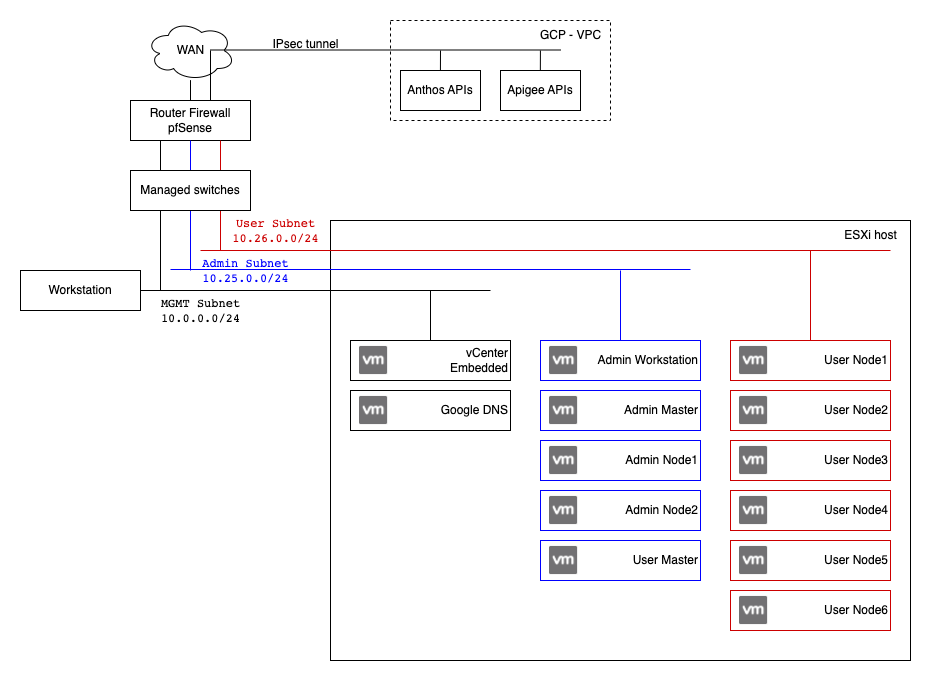

# VMware Apigee hybrid

This repository contains code to setup Apigee hybrid on VMware without internet access for cluster VMs.

It's based on the official tutorial available here [Apigee hybrid](https://cloud.google.com/apigee/docs/hybrid/v1.7/big-picture).

## Deployment Details

* [VMware ESXi](https://www.vmware.com/products/esxi-and-esx.html) 7.0 U1+
* [VMware vCenter Server](https://www.vmware.com/products/vcenter-server.html) 7.0 U1+
* [Anthos clusters on VMware](https://cloud.google.com/anthos/clusters/docs/on-prem/1.10/overview) 1.10
  * [gkeadm](https://cloud.google.com/anthos/clusters/docs/on-prem/1.10/downloads) 1.10.3-gke.49
  * gkectl 1.10.3-gke.49 (git-b074b66a3)
* [Anthos Service Mesh](https://cloud.google.com/apigee/docs/hybrid/v1.7/install-asm) 1.13.x
  * [asmcli](https://cloud.google.com/service-mesh/v1.13/docs/unified-install/install-dependent-tools#download_asmcli) 1.13.4-asm.4+config2
* [Apigee Hybrid](https://cloud.google.com/apigee/docs/hybrid/v1.7/big-picture) 1.7.2

## Network diagram

## Subnets

| Name | VLAN ID | CIDR | Purpose |
|------|---------|------|---------|
| Main | 1 |`10.0.0.0/24` | Workstation, pfSense, ESXi, vCenter |
| Admin subnet | 25 |  `10.25.0.0/24` | Anthos admin workstation + admin cluster |
| User subnet | 26 | `10.26.0.0/24` | Anthos user cluster (apigee hybrid runtime) |

## Static IPs and VIPs

| Name | Segment | Value |
|------|---------|-------|
| ESXi | Main | `10.0.0.10` |
| vCenter | Main | `10.0.0.11` |
| Google DNS | Main | `10.0.0.20` |
| NTP (pfSense) | Main | `10.0.0.1` |
| Admin control plane VIP | Admin subnet | `10.25.0.50` |
| User control plane VIP | Admin subnet | `10.25.0.51` |
| User anthos ingress VIP | User subnet | `10.26.0.50` |
| User apigee ingress VIP | User subnet | `10.26.0.51` |

## Load Balancing

Configure load balancing on with HAProxy on pfSense & VIPs:

| Name                           | VIP          | Frontend Port | Server Pool           | Server Port |
|--------------------------------|--------------|---------------|-----------------------|-------------|
| gke-admin-cluster-cp           | `10.25.0.50` | 443           | gke-apigee-admin{1-3} | 30968       |
| gke-user-cluster-cp            | `10.25.0.51` | 443           | gke-apigee-admin{4}   | 30562       |
| gke-user-cluster-konnectivity  | `10.25.0.51` | 8132          | gke-apigee-admin{4}   | 30563       |
| gke-user-cluster-anthos-ingress | `10.26.0.50` | 80, 443      | gke-apigee-user{1-6}  | 30243, 30879 |
| gke-user-cluster-apigee-ingress | `10.26.0.51` | 443          | gke-apigee-user{1-6}  | 30397        |

## Steps

* [GCP Tunnel](01-gcp-tunnel/README.md)
